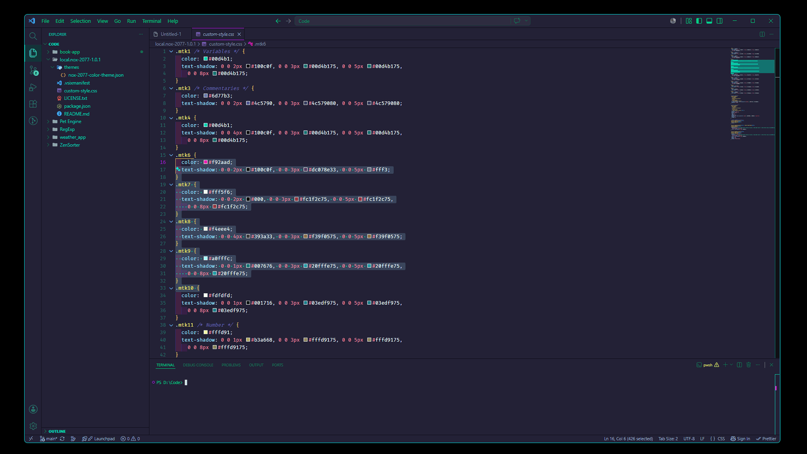
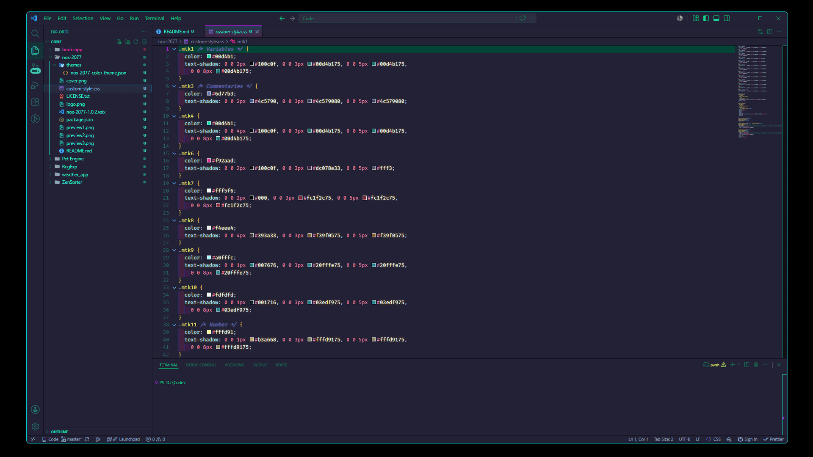
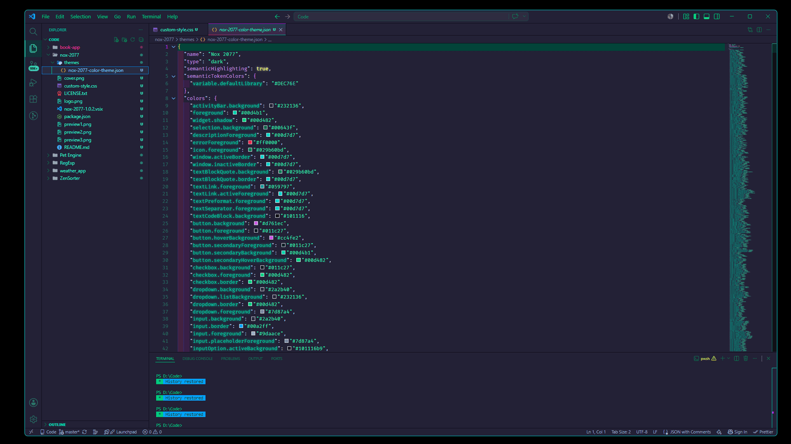

# Nox 2077 — VS Code Theme

## Where cyberpunk neon meets personal taste

Nox 2077 is a handcrafted VS Code theme built on the shoulders of two excellent projects: the atmospheric cyberpunk glow of [Synthwave '2077](https://github.com/SBigz/Synthwave-2077) by [CodeSacha](https://github.com/SBigz), and the foundational retro-futurist palette of [Synthwave '84](https://github.com/robb0wen/synthwave-vscode) by [robbOwen](https://github.com/robb0wen).

The base was already close to perfect. What Nox 2077 adds is a personal visual language built around the [Rosé Pine Moon](https://rosepinetheme.com/) background palette — deep purple-slate tones at `#232136` instead of near-black — combined with a Tokyo Night-inspired syntax color system: warm golds for types, cyan-blues for operators, soft rose for variables, bright teal for strings. The neon glow effects from the original CSS are preserved intact.

Nox is Latin for night — the kind of deep, electric night that exists only in cyberpunk cities, where darkness is not empty but saturated with neon. 2077 carries the lineage forward from Synthwave '2077, the theme this is built on. Together: a night that belongs to the year 2077, rendered in code.

## What changed from Synthwave '2077

- **Background** shifted from near-black `#101116` to Rosé Pine Moon `#232136` — warmer, less harsh in long sessions
- **Syntax palette** replaced with a Tokyo Night-derived system: distinct color assignments per token category instead of the original monochromatic green
- **Bracket highlights** use six distinct neon colors for easy nesting depth reading
- **Active line** highlight is deep teal `#034439` — visible but not distracting
- **Status bar, activity bar, sidebar, tabs** all harmonized to the new background
- **Purple accent** `#ba1aef` replaces the original teal for active tab borders and line numbers
- **Neon glow CSS** from the original is kept unchanged — same mtk class effects, same active tab gradient

## Key Features

- Deep purple-slate backgrounds easy on the eyes in dark environments
- Carefully assigned syntax colors — each token category has its own hue, not a shared palette
- Six-color bracket pair highlighting
- Full neon glow on syntax tokens via Custom CSS and JS Loader
- Compatible with JavaScript, TypeScript, HTML, CSS, Python, and most major languages

## Take a look

## Installation

1. Open the Marketplace in Visual Studio Code and search for **"Nox 2077."**
2. Click the **Install** button to add the theme to your VS Code.
3. Once the installation is complete, click **Reload** to refresh your editor.
4. To activate the theme, go to **File → Preferences → Color Theme** and select **Nox 2077.**
5. To enable the neon glow effects, install [Custom CSS and JS Loader](https://marketplace.visualstudio.com/items?itemName=be5invis.vscode-custom-css) and point it to the included `custom-style.css` file using the **Enable Custom CSS and JS** command in the command palette `Ctrl+Shift+P` or `Cmd+Shift+P` on Mac.
6. To disable the glow, use the **Disable Custom CSS and JS** command in the command palette.
7. Each time you enable or disable the custom styles, VS Code will reload to apply the changes.
8. To customize your terminal theme, install [oh my zsh!](https://github.com/ohmyzsh/ohmyzsh) and choose your desired theme!

For neon glow effects, install the Custom CSS and JS Loader extension from the Marketplace — it allows injecting external styles into the editor. Before proceeding, read its documentation: on Windows, VS Code must be launched as administrator. Copy the file path and add it to your VSCode's settings.json file.

On MacOS it look something like the below:

{ "vscode_custom_css.imports": [ "file:///Users/ADD_YOUR_USERNAME/.vscode/extensions/sadig.nox-2077-1.0.2/custom-style.css" ] }

On Windows:

{ "vscode_custom_css.imports": [ "file:///C:/Users/ADD_YOUR_USERNAME/.vscode/extensions/sadig.nox-2077-1.0.2/custom-style.css" ] }

## Inspiration

Background tones inspired by the [Rosé Pine Moon](https://rosepinetheme.com/) palette by [mvllow](https://github.com/mvllow) — specifically the warm purple-slate base that makes long coding sessions easier on the eyes than pure black.

## Disclaimer

I am not a professional theme developer — I simply fell in love with the cyberpunk neon aesthetic of Synthwave '2077 and wanted to reshape it around my own color sensibility.

## Credits ✨

- [Synthwave '2077](https://github.com/SBigz/Synthwave-2077) VS Code Theme by [CodeSacha / SBigz](https://github.com/SBigz)
- [Synthwave '84](https://github.com/robb0wen/synthwave-vscode) VS Code Theme by [robbOwen](https://github.com/robb0wen)
- [Cyberpunk 2077 rebuild](https://github.com/carlos18mz/Cyberpunk-2077-rebuild) VS Code Theme by [carlos18mz](https://github.com/carlos18mz)

## License

This theme is a derivative work. The original Synthwave '2077 is distributed under the MIT License — see [LICENSE.txt](./LICENSE.txt). This derivative is released under the same terms.

## Enjoy!

If you enjoy the theme, please give it a ⭐️ on [GitHub](https://github.com/sadikh94/nox-2077) — it means a lot and helps others find it!
